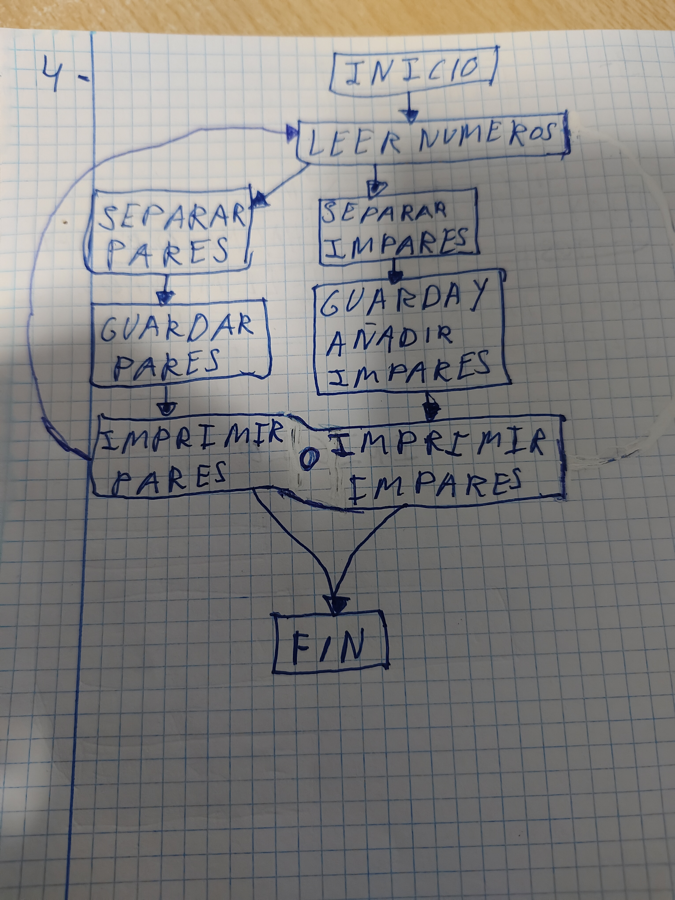

# SGE_B_Python

# Diagrames de flux que diuen que fa el programa 

## 1 Exercici
### Aquest es el primer exercici esta fet amb for y while.  

## 2 Exercici
### Aquest es el segon exercici esta fet amb for.   

## 3 Exercici
### Aquest es el tercer exercici esta fet amb for.   

## 4 Exercici
### Aquest es el quart exercici esta fet amb for.   

## 5 Exercici
### Aquest es el cinque exercici esta fet amb for.   

## 6 Exercici
### Aquest es el sise exercici esta fet amb while.   

## 7 Exercici
### Aquest es el sete exercici esta fet amb while.   
